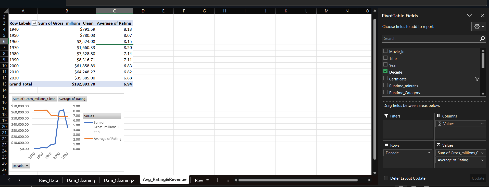
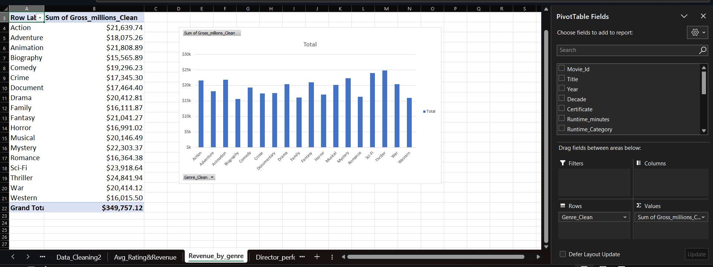
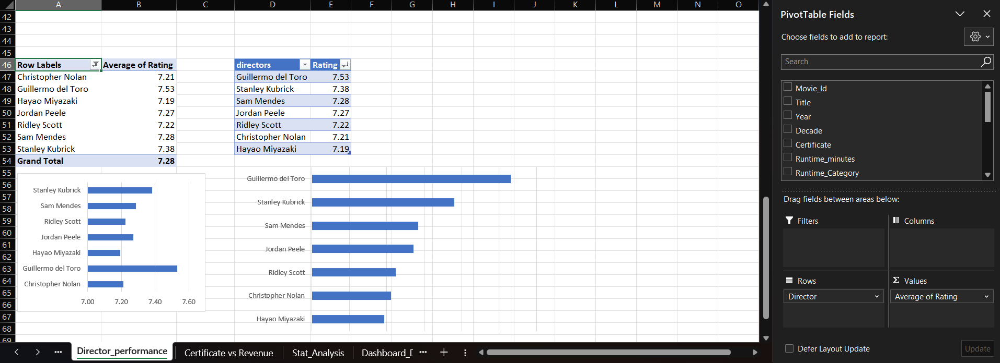
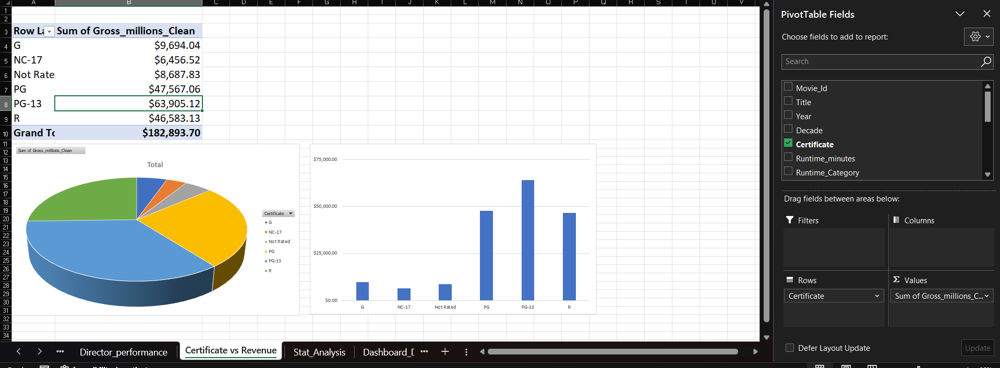
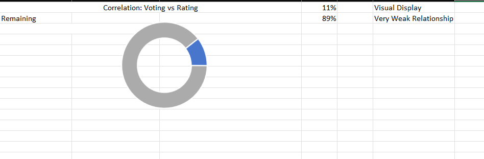
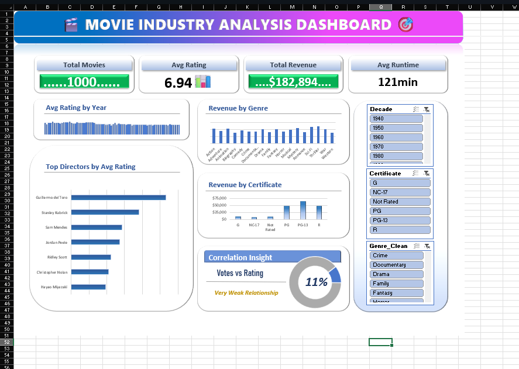

# 🎬 Movie Data Analysis & Interactive Dashboard — Excel

## 📌 Project Overview

This project is an end-to-end **Movie Data Analysis project built entirely in Microsoft Excel**.

The objective was to clean, transform, analyze, and visualize movie-related data to uncover insights around **ratings, revenue, genres, directors, certificates, runtime, and audience votes**.

The project demonstrates practical Excel data analytics skills including:

* Data Cleaning & Transformation
* Excel Tables
* Excel Formulas
* Pivot Tables
* Statistical Analysis
* Data Aggregation
* Data Visualization
* Interactive Dashboard Development
* Business/Analytical Insights

---

## 📊 Dataset

The dataset contains information about approximately **1,000 movies**, including:

* Movie ID
* Movie Title
* Release Year
* Certificate
* Runtime
* Genre
* Rating
* Metascore
* Description
* Director
* Stars
* Votes
* Gross Revenue

Revenue is represented in **millions**.

---

## 🛠️ Tools & Technologies

**Tool:** Microsoft Excel

### Excel Skills Used

* Excel Tables
* Pivot Tables
* Calculated Columns
* `IF`
* `FLOOR`
* `AVERAGE`
* `CORREL`
* Conditional Logic
* Data Cleaning
* Data Transformation
* Data Categorization
* Charts & Visualizations
* Dashboard Design

---

## 🔄 Project Workflow

### 1. Raw Data

The `Raw_Data` sheet contains the original movie dataset.

The data includes movie information such as title, year, genre, rating, director, votes, and gross revenue.

---

### 2. Data Cleaning & Transformation

The `Data_Cleaning` sheet was created to prepare the raw dataset for analysis.

Key transformations include:

* Standardizing column names
* Creating movie IDs
* Creating **Decade** from release year
* Categorizing movies based on runtime
* Splitting genres into separate columns
* Cleaning revenue-related fields
* Creating profitability indicators
* Preparing fields for analytical use

Example runtime categories:

* **Short:** < 90 minutes
* **Medium:** 90–120 minutes
* **Long:** > 120 minutes

---

### 3. Data Preparation

The `Data_Cleaning2` sheet provides a further transformed dataset with cleaned and structured fields that are easier to use for Pivot Tables and analysis.

Genre information was also standardized into a clean analytical field.

---

## 📈 Analysis Performed

### ⭐ Rating & Revenue Analysis

The `Avg_Rating&Revenue` sheet analyzes movie revenue and average rating across different release periods.

This helps investigate how movie performance and ratings vary across different decades.


---

### 🎭 Revenue by Genre

The `Revenue_by_genre` sheet analyzes total gross revenue across different movie genres.

This can be used to identify which genres generate the highest overall revenue.


---

### 🎬 Director Performance

The `Director_performance` sheet evaluates directors based on:

* Average movie rating
* Number of movies/titles

This provides a view of both **quality and volume of output** by director.


---

### 🔞 Certificate vs Revenue

The `Certificate vs Revenue` analysis compares movie certificates with total gross revenue.

This helps identify whether different content-rating categories are associated with different revenue performance.


---

### 📊 Statistical Analysis

The `Stat_Analysis` sheet includes statistical analysis, including the relationship between:

**Audience Votes vs Movie Rating**

The project uses the Excel `CORREL()` function to calculate the correlation between these variables.


---

# 📊 Dashboard

The project includes an Excel dashboard designed to provide a quick overview of movie performance.

The dashboard summarizes key metrics such as:

* Total Number of Movies
* Average Rating
* Total Gross Revenue
* Average Runtime

It also provides visual analysis of movie performance using the underlying Pivot Table and analytical data.


---

## 💡 Key Analytical Questions

The project attempts to answer questions such as:

1. Which movie genres generate the highest revenue?
2. How does average movie rating vary across decades?
3. Which directors have the highest average ratings?
4. How does the number of movies produced by directors compare with their average rating?
5. How does movie certificate relate to total revenue?
6. Is there a relationship between audience votes and movie ratings?
7. What is the overall average rating of the movies?
8. What is the average runtime of movies?
9. What is the total gross revenue generated by the dataset?

---

## 📌 Key Metrics

Based on the prepared dashboard data:

| KPI                 |       Value |
| ------------------- | ----------: |
| Movies              |       1,000 |
| Average Rating      |        6.94 |
| Total Gross Revenue | 182,893.70M |
| Average Runtime     |  120.62 min |

---

## 📂 Project Structure

```text
Excel-Movie-Data-Analysis/
│
├── README.md
│
├── Excel/
│   └── Movie_Analysis_Excel_Project.xlsx
│
├── images/
│   ├── movie_analysis_dashboard.png
│   ├── correlation_votes_vs_rating.png
│   ├── certificate_vs_revenue.png
│   ├── director_performance.png
│   ├── revenue_by_genre.png
│   └── rating_revenue_by_decade.png
│
└── Documentation/
    └── Key_Findings.md
```

---

## 🎯 Skills Demonstrated

This project demonstrates practical experience in:

**Data Analytics**

* Data Cleaning
* Data Transformation
* Exploratory Data Analysis
* Statistical Analysis
* KPI Analysis
* Pattern Identification

**Microsoft Excel**

* Advanced Excel formulas
* Excel Tables
* Pivot Tables
* Data Categorization
* Charts
* Dashboard Development
* Data Visualization

---

## 🚀 Future Improvements

Potential improvements to the project include:

* Adding more interactive dashboard filters
* Adding year/decade slicers
* Adding genre and certificate slicers
* Adding advanced KPI cards
* Performing deeper profitability analysis
* Adding trend analysis
* Automating the data-refresh process
* Connecting the project to Power BI for advanced visualization

---

## 👩‍💻 Author

**Ruchita Kumbhare**

Data Analyst | SQL | Python | Excel | Power BI | Data Visualization

